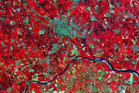

background-image: url(https://www.esa.int/var/esa/storage/images/esa_multimedia/images/2024/06/sentinel-2c_image/26153788-1-eng-GB/Sentinel-2C_image.jpg)
background-size: cover
background-position: center
class: center, middle, inverse

# Sentinel-2

## A high-resolution multispectral mission for land monitoring

### Week 2 Learning Diary Presentation

---

class: inverse, center, middle

# What is Sentinel-2?

---

# Sentinel-2

Sentinel-2 is part of the Copernicus Earth observation programme.

It is a high-resolution optical mission designed mainly for land monitoring.

The mission is based on multispectral imaging and is widely used for vegetation soil water and land cover analysis.

It provides data that is freely accessible and widely used in both research and operational contexts.

Sentinel-2 is especially useful because it combines good spatial detail with frequent repeat coverage.

---
# Key facts

<table style="width: 72%; margin: 1.5rem auto; border-collapse: collapse; font-size: 0.95em; color: white;">
  <tr style="background: #1e3a8a; color: white;">
    <th style="padding: 12px; border: 1px solid rgba(255,255,255,0.25);">Feature</th>
    <th style="padding: 12px; border: 1px solid rgba(255,255,255,0.25);">Sentinel-2</th>
  </tr>

  <tr style="background: #1f2937;">
    <td style="padding: 10px;">Sensor type</td>
    <td style="padding: 10px;">Optical multispectral</td>
  </tr>

  <tr style="background: #111827;">
    <td style="padding: 10px;">Spectral bands</td>
    <td style="padding: 10px;">13</td>
  </tr>

  <tr style="background: #1f2937;">
    <td style="padding: 10px;">Swath width</td>
    <td style="padding: 10px;">290 km</td>
  </tr>

  <tr style="background: #111827;">
    <td style="padding: 10px;">Revisit time</td>
    <td style="padding: 10px;">About 5 days</td>
  </tr>

  <tr style="background: #1f2937;">
    <td style="padding: 10px;">Main focus</td>
    <td style="padding: 10px;">Land vegetation soil water coastal monitoring</td>
  </tr>
</table>

---
# Why it is useful

.pull-left[

Sentinel-2 is useful because it can support:

- Vegetation monitoring
- Land cover classification
- Urban change analysis
- Water and coastal observation
- Disaster and emergency mapping

]

.pull-right[

  

Sentinel-2 imagery

]
---

# Applications

.pull-left[

## Environmental use

Sentinel-2 is commonly used to monitor vegetation health and environmental change.

Its spectral bands make it suitable for indices such as NDVI.

This makes it useful for tracking how landscapes change over time.

]

.pull-right[

## Urban use

Sentinel-2 can also support urban analysis.

It can be used for land cover mapping urban expansion and green space identification.

This makes it relevant to planning and environmental management within cities.

]

---

# Limitations

There are also important limitations to Sentinel-2.

For example cloud cover can obscure the Earth’s surface.
It is therefore less reliable in persistently cloudy conditions.

Also Urban environments can also be difficult to interpret where different surfaces appear spectrally similar.

A useful satellite still needs to be matched to the right context and the right analytical method.

---
# Why I chose Sentinel-2

I chose Sentinel-2 because it is practical accessible and highly relevant to the themes of this module.

It links clearly to topics such as spectral signatures land cover classification NDVI and urban analysis.

It also feels more relevant to my own interests because it offers a realistic balance between technical capability and practical usability.

In my current role working with geospatial and address data in a local authority context, Sentinel-2 could have practical applications. For example, it could support monitoring of green space, identification of land use change, and provide additional context alongside existing datasets such as address records and planning information.

This highlights how satellite data could complement existing systems, helping to improve environmental monitoring and support more informed decision-making.

---

class: center, middle, inverse

# Thank you

## Sentinel-2 is a strong example of how Earth observation data can be both accessible and operationally useful

